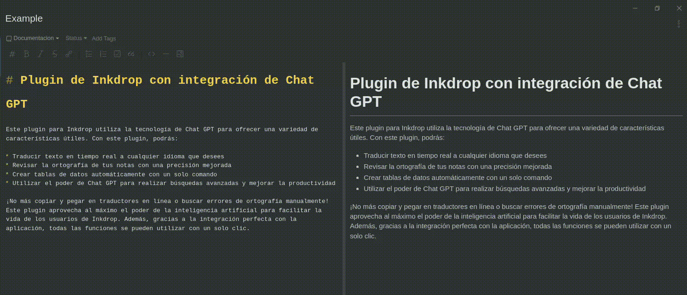
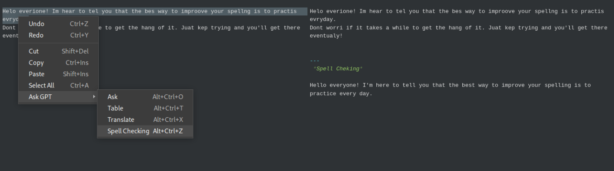
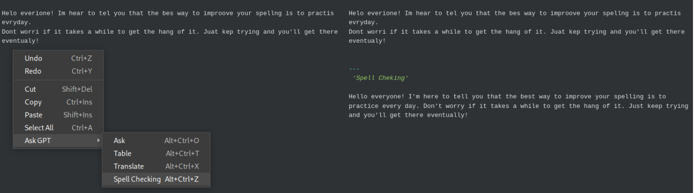

# Ask GPT: inkdrop plugin

A plugin adds multiple functionalities using OpenAI GPT Chat



## Features
This plugin offers the following features:

* Text translation into the desired language.
* Paragraph spellchecking.
* Table creation based on data.
* General use of Chat GPT.


## Install

```bash
ipm install ask-gpt
```

To use the Chat GPT plugin for Inkdrop, you will need an OpenAI API key. Follow the steps below to obtain your API key and install the plugin:

1. Go to https://platform.openai.com/ and log in. If you don't have an account, create one.
2. Once you have an account, go to https://platform.openai.com/account/api-keys.
3. Click on "Create new secret key" to generate a new API key.
4. Copy the API key that is generated.
5. Open the Inkdrop app and go to 'Preferences -> Plugins -> ask-gpt'.
6. In the settings, paste your OpenAI API key into the 'Open AI API key'.

## Usage

### Translation and spellchecking

To use the translation or spellchecking function, select the text you want to translate or correct. If no text is selected, the function will be applied to the entire note.




To change the translation language to one other than the default language, simply add the request 'Translate to French', replacing 'French' with the desired language, at the end of the document.

### Table creation

To use the table creation function, make sure you have matching data. Once you have your data, simply type in the corresponding command and the table will be created automatically.


### General use of Chat GPT

To use the general chat function, simply add your request. If you wish to continue the conversation, add "---" and your next request to continue.

## Keybindings

| Keybinding | Description                      |
| ---------- | -------------------------------- |
| Ctrl-Alt-O | Asks a prompt using GPT          |
| Ctrl-Alt-T | Generates a table using GPT       |
| Ctrl-Alt-X | Translates text using GPT         |
| Ctrl-Alt-Z | Performs spell checking using GPT |

## Settings

| Config Key    | Description                      | Default Value |
| ------------- | -------------------------------- | ------------- |
| gptApiKey     | Open AI API key                  | 'None'        |
| language      | Language translation             | 'English'     |
| timeout       | Time out for requests in seconds | 60            |

### Settings UI

